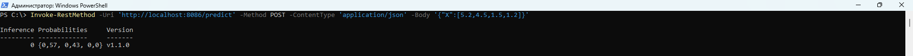
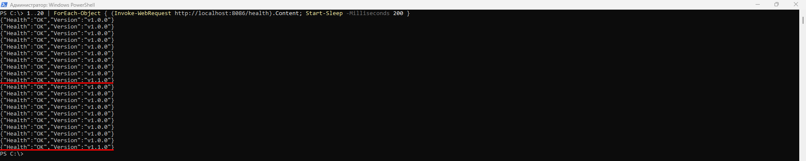
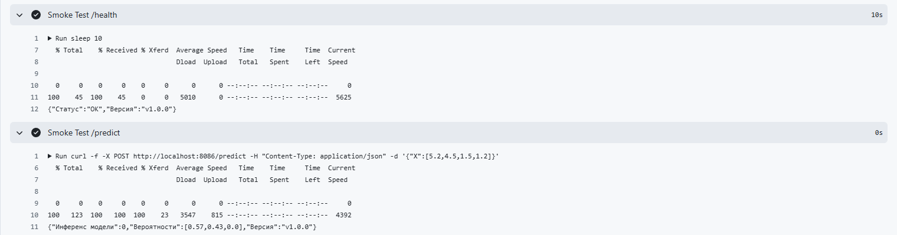

# HW3. Настройка стратегий развертывания модели
Автор: Можогин Сергей Сергеевич, Науки о данных, 14.12.2025

## Краткое описание проекта
Проект демонстрирует цикл **MLOps** для сервиса машинного обучения: от обучения и упаковки модели в **Docker-контейнер** до автоматизированного **CI/CD** и выкатки новых версий в продакшн. ML-модель разворачивается, как **REST-API** (**FastAPI**) с эндпоинтами **/health** и **/predict**, поддерживающими версионирование через переменные окружения.

Деплой реализован с использованием стратегии **Canary Deployment**: несколько версий сервиса (**ml-service_blue**/**ml-service_green**) запускаются параллельно, а веб-сервер **Nginx** распределяет трафик между ними (например, в пропорции 90%/10%) с возможностью постепенного увеличения доли новой версии и быстрого rollback. Проект также включает **GitHub Actions** для сборки, тестирования, публикации **Docker-образов** и **smoke-тестов** после деплоя.

## Команды сборки и запуска на **PowerShell**
```
# Сборка контейнеров Docker:
docker compose -f docker-compose.blue.yml -f docker-compose.green.yml -f docker-compose.nginx.yml up -d
```
```
# Вызов метода /health:
Invoke-RestMethod -Uri http://localhost:8086/health -Method GET
```
```
# Вызов метода /predict:
Invoke-RestMethod -Uri 'http://localhost:8086/predict' -Method POST -ContentType 'application/json' -Body '{"X":[5.2,4.5,1.5,1.2]}'
```
```
# Тест балансировщика:
1..20 | ForEach-Object { (Invoke-WebRequest http://localhost:8086/health).Content; Start-Sleep -Milliseconds 200 }
```
```
# Изменение доли балансировки между сервисами ml-service_blue и ml-service_green в соотношении 50/50 в файле nginx.conf
upstream ml_backend {
  server ml-service_blue:8080  weight=1;
  server ml-service_green:8080 weight=1;
}

# Перезапуск конфигурации Nginx
docker compose -f docker-compose.blue.yml -f docker-compose.green.yml -f docker-compose.nginx.yml exec -T nginx nginx -s reload
```
```
# Полное переключение трафика на сервис ml-service_blue в файле nginx.conf
upstream ml_backend {
  server ml-service_blue:8080 weight=1;
}

# Перезапуск конфигурации Nginx
docker compose -f docker-compose.blue.yml -f docker-compose.green.yml -f docker-compose.nginx.yml exec -T nginx nginx -s reload
```
```
# Полное переключение трафика на сервис ml-service_green в файле nginx.conf
upstream ml_backend {
  server ml-service_green:8080 weight=1;
}

# Перезапуск конфигурации Nginx
docker compose -f docker-compose.blue.yml -f docker-compose.green.yml -f docker-compose.nginx.yml exec -T nginx nginx -s reload
```

## Скриншоты вывода команд после запуска контейнеров
Локальная проверка метода /health:

Локальная проверка метода /predict:

Локальная проверка балансировщика (в пропорции 90%/10%):

Проведение Smoke Tests в GitHub Actions:
